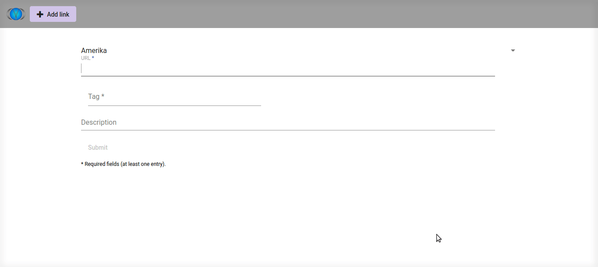

# Tag Database Project
 
This project is an exercise to practice things, I have learned recently:

## Structure
- MySQL database
- Python Flask REST API (local)
- Angular GUI

## Goals
Instead of further using my old MS Excel link lists
 (that were once MS Word lists), I will create a local database program that helps to manage the data, especially the tags. E.g. there will be consistency checking, checking for synonyms and plural-singular forms - for short, measures to avoid things that deteriorate the efficiency of the tag system.

## Current functionality
- The database contains links that can be tagged and associated to a domain.
- The tags can be filtered by domain.
- Also, the links can be linked to a description.
- In order to get a vague impression of when the link has been added, a chronology indication (currently text, mostly date indications), is linked to the link.
- The stored procedures that are used to create new data are accessible via the REST API.
- The GUI can be used to add a link (with tag(s) and an optional description) and to add new tags.

## Notes
I will update the project from time to time.

### Database
You can use the scripts in the db folder to create the database in a few steps. Thus, you can leave out the sample data or easily change the structure to your liking. Before adding data to the database, the procedures can be tested with check_tag_db_procedures.

### REST API
I am using Gunicorn to serve the Flask app.

### GUI
Angular is served by Apache2.

 
<b>Adding a link to the database</b>

- a domain is selected per default
- the tags available in the autocomplete list are filtered by the domain
- if, after filtering the available tags with autocomplete, there are no tags left, the whole list of tags is used for the autocomplete list, i.e. the tags are not filtered by the domain
- when characters are entered into the tag field, a new empty one is created and the newest one is deleted, if the second newest one is empty, so that there is always one empty tag field to add a tag (this behaviour is inspired by MS Access lists)
- a mouse is not required to use the form
- the url is split into its parts which are a bit prettified (e.g. characters like '-' are replaced by whitespaces), so that it might be easier for the user extract relevant information for the tagging process from the url
- when a tag is submitted, that did not exist in the database before, it is automatically added and the tags are reloaded

## Next steps
- add functionality of adding a domain, displaying the data
